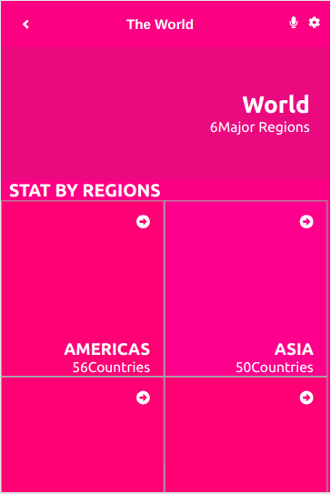

  <h3><b>countries-api</b></h3>

<!-- TABLE OF CONTENTS -->

# 📗 Table of Contents

- [📖 About the Project](#about-project)
  - [🛠 Built With](#built-with)
    - [Tech Stack](#tech-stack)
    - [Key Features](#key-features)
  - [🚀 Live Demo](#live-demo)
- [💻 Getting Started](#getting-started)
  - [Setup](#setup)
  - [Prerequisites](#prerequisites)
  - [Install](#install)
  - [Usage](#usage)
  - [Run tests](#run-tests)
  - [Deployment](#triangular_flag_on_post-deployment)
- [👥 Authors](#authors)
<!-- - [🔭 Future Features](#future-features) -->
- [🤝 Contributing](#contributing)
- [⭐️ Show your support](#support)
- [🙏 Acknowledgements](#acknowledgements)
- [❓ FAQ](#faq)
- [📝 License](#license)

<!-- PROJECT DESCRIPTION -->

# 📖 [countries-api] 

**[countries-api]**is a web application that shows major regions and countries in the world. It fetches data from <a href="https://restcountries.com/#api-endpoints-v3-all">REST COUNTRIES API</a>

## 🛠 Built With 
HTML, CSS, Es6 Javascript
### Tech Stack 

  
Client

  <ul>
    <li><a href="https://react-redux.js.org/">React Redux</a></li>
  </ul>

<!-- Features -->

### Key Features 

>Here are the key features of the application.

- Fetches data from the OpenWeatherMap API
- Displays a home page with different regions in the world
- Allows users to click on each region to view detailed  information
- Search bar to filter regions, countries by name

(<a href="#readme-top">back to top</a>)

<!-- LIVE DEMO -->

## 🚀 Live Demo 

[Live Demo Link]()

(<a href="#readme-top">back to top</a>)

<!-- GETTING STARTED -->

## 💻 Getting Started 

To get a local copy up and running, follow these steps.

### Prerequisites

In order to run this project you need:

Github, CSS, Javascript, Code editor, Browser, Internet

### Setup

Clone this repository to your desired folder:
Run `git clone [url](https://github.com/Bornittah/countries-api.git)`

### Install

Install this project with:
`npm install`

### Usage

To run the project, execute the following command:
`npm start`

### Run tests

To run tests, run the following command:
`npm test`

### Deployment

You can deploy this project using:
`npm deploy`

(<a href="#readme-top">back to top</a>)

<!-- AUTHORS -->

## 👥 Authors 

👤 **Author1**

- GitHub: [@Bornittah](https://github.com/Bornittah)
- Twitter: [@AgashaBornittah](https://twitter.com/AgashaBornittah)
- LinkedIn: [Bornittah](www.linkedin.com/in/agasha-bornittah)

(<a href="#readme-top">back to top</a>)

<!-- FUTURE FEATURES -->

<!-- ## 🔭 Future Features 

> Describe 1 - 3 features you will add to the project.

- [ ] **[new_feature_1]**
- [ ] **[new_feature_2]**
- [ ] **[new_feature_3]**

(<a href="#readme-top">back to top</a>)
 -->

<!-- CONTRIBUTING -->

## 🤠Contributing 

Contributions, issues, and feature requests are welcome!

Feel free to check the [issues page](https://github.com/Bornittah/countries-api/issues).

(<a href="#readme-top">back to top</a>)

<!-- SUPPORT -->

## ⭐️ Show your support 

Give a ⭐️ if you like this project!

(<a href="#readme-top">back to top</a>)

<!-- ACKNOWLEDGEMENTS -->

## 🙠Acknowledgments 

I would like to thank all the code reviewers for their feedback

(<a href="#readme-top">back to top</a>)

<!-- FAQ (optional) -->

## ❓ FAQ 

- **[How to create anew react app]**

  - [Refer to this documentation](https://reactjs.org/docs/create-a-new-react-app.html)

(<a href="#readme-top">back to top</a>)

<!-- LICENSE -->

## 📠License 

This project is [MIT](./LICENSE) licensed.

(<a href="#readme-top">back to top</a>)

